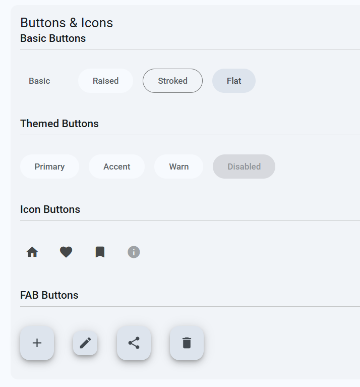

# 🎨 ngx-mat-grayscale-theme

A minimalist grayscale theme for Angular Material 20 with professional gray tones and clean design without shadows.

## ✨ Features

- 🎯 **Professional gray tones** without color accents
- 🚫 **No shadows** - clean, flat design
- 🔲 **Subtle borders** instead of shadows
- 🌙 **Light and dark themes** with full support
- ♿ **High contrast versions** for better accessibility
- 🎛️ **Complete theme switcher** component
- 🔧 **Angular 20 compatibility**



## 📦 Installation

```bash
npm install ngx-mat-grayscale-theme
```

## 🚀 Usage in Angular 20 Application

### 1. Import Styles

In `src/styles.scss`:

```scss
// Import grayscale theme (replaces default Angular Material theme)
@import 'ngx-mat-grayscale-theme/grayscale-ui-theme';

// Your custom global styles
html, body { height: 100%; }
body { margin: 0; font-family: Roboto, "Helvetica Neue", sans-serif; }
```

### 2. Configure Provider

In `src/main.ts`:

```typescript
import { bootstrapApplication } from '@angular/platform-browser';
import { AppComponent } from './app/app.component';
import { provideGrayscaleTheme } from 'ngx-mat-grayscale-theme';
import { provideAnimationsAsync } from '@angular/platform-browser/animations/async';

bootstrapApplication(AppComponent, {
  providers: [
    provideAnimationsAsync(),
    provideGrayscaleTheme({
      defaultTheme: 'light',
      enableHighContrast: true,
      storageKey: 'grayscale-theme'
    })
  ]
}).catch(err => console.error(err));
```

### 3. Add Theme Toggle

In your component:

```typescript
import { Component } from '@angular/core';
import { ThemeToggleComponent } from 'ngx-mat-grayscale-theme';

@Component({
  selector: 'app-root',
  standalone: true,
  imports: [ThemeToggleComponent],
  template: `
    <mat-toolbar>
      <span>My Application</span>
      <span class="spacer"></span>
      <mat-gray-theme-toggle></mat-gray-theme-toggle>
    </mat-toolbar>
  `
})
export class AppComponent {}
```

### 4. Using ThemeService

```typescript
import { Component, inject } from '@angular/core';
import { ThemeService, Theme } from 'ngx-mat-grayscale-theme';

@Component({
  selector: 'app-example',
  template: `
    <p>Current theme: {{ themeService.getThemeLabel() }}</p>
    <button (click)="toggleTheme()">Toggle Theme</button>
  `
})
export class ExampleComponent {
  themeService = inject(ThemeService);

  toggleTheme() {
    this.themeService.toggleTheme();
  }

  setSpecificTheme() {
    this.themeService.setTheme('dark-high-contrast');
  }
}
```

## 🎛️ API Reference

### ThemeService

| Method | Description |
|--------|-------------|
| `getCurrentTheme()` | Returns current theme |
| `setTheme(theme: Theme)` | Sets specific theme |
| `toggleTheme()` | Toggles between light and dark |
| `toggleHighContrast()` | Toggles high contrast mode |
| `isDark()` | Returns true if dark theme is active |
| `isLight()` | Returns true if light theme is active |
| `isHighContrast()` | Returns true if high contrast is active |
| `getThemeLabel()` | Returns theme name label |

### Available Themes

- `'light'` - Light theme
- `'dark'` - Dark theme
- `'light-high-contrast'` - Light with high contrast
- `'dark-high-contrast'` - Dark with high contrast

### Provider Configuration

```typescript
interface GrayscaleThemeConfig {
  defaultTheme?: 'light' | 'dark' | 'light-high-contrast' | 'dark-high-contrast';
  enableHighContrast?: boolean;
  storageKey?: string;
}
```

## 🎨 Design Principles

### Colors
- **Primary palette**: Professional gray tones
- **No color accents**: Consistent grayscale design
- **High contrast**: Optimized for accessibility

### Styles
- **No shadows**: All Material components have removed box-shadow
- **Subtle borders**: 1px solid borders instead of shadows
- **Clean interface**: Minimalist, professional appearance

## 🔧 Development

### Requirements
- Angular 20+
- Angular Material 20+
- TypeScript 5.8+

### Building the Library

```bash
ng build ngx-mat-grayscale-theme
```

### Demo Application

```bash
ng serve demo
```

## 📄 License

MIT

## 🤝 Contributing

Contributions are welcome! Please create an issue or pull request.

## 📞 Support

For questions and issues, please create an issue in the GitHub repository.